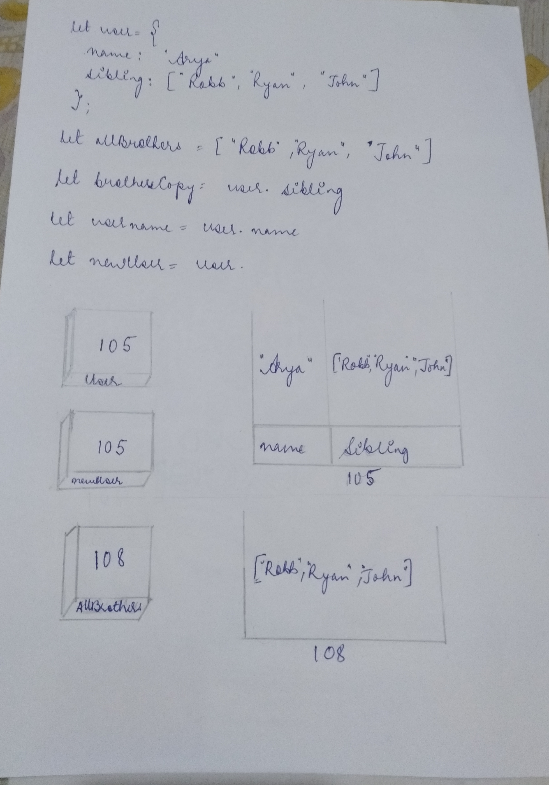

```js
let user = {
  name: "Arya",
  sibling: ["Robb", "Ryan", "John"],
};
let allBrothers = ["Robb", "Ryan", "John"];
let brothersCopy = user.sibling;
let usename = user.name;
let newUser = user;
```

1. Memory representation

- Create the memory representation of the above snippet on notebook.
- Take a photo/screenshot and add it to the folder `code`

<!-- To add this image here use  -->



2. Answer the following with reason:

- `user == newUser;` // true

reason :

when object are created they are created somewhere else in the memory and its memory address is stored in the varible for example when we created the user object it got created somewhere else in the memory and its memory address got stored in the user , so when we copied the user to newUser the address of user got copied in newUser so when we are compring them we got the answer true.

- `user === newUser;` true

  the reason is same as above, but with triple equal to it checks if the data types are also same and in this case since both the variable has same memory address that is why it is also true

- `user.name === newUser.name;` true

since both of them are pointing towards the same memory location and value stored inside the key of that object are same and the data type of value are also same that is why the answer is true

- `user.name == newUser.name;` true

since both of them are pointing towards the same memory location and and value stored inside the key of that object are same
that is why the answer is true

- `user.sibling == newUser.sibling;` true

since both of them are pointing towards the same memory location and and value stored inside the key of that object are same
that is why the answer is true

- `user.sibling === newUser.sibling;` true

since both of them are pointing towards the same memory location and value stored inside the key of that object are same and the data type of value are also same that is why the answer is true

- `user.sibling == allBrothers;` false

reason : Arrays are also object data type so when we create an object is gets created somewhere else in the memory and its address gets stored in the variable, here the variable is allBrothers ,so even both the variable user and allBrothers have same value the answer will be false because memory location of both the variable are same.

- `user.sibling === allBrothers;` false

reason : Arrays are also object data type so when we create an object is gets created somewhere else in the memory and its address gets stored in the variable, here the variable is allBrothers ,so even both the variable user and allBrothers have same value the answer will be false because memory location of both the variable are same.

- `brothersCopy === allBrothers;` false

reason: since memory location of brothers and allBrothers are different the answer is false

- `brothersCopy == allBrothers;` false
  reason: since memory location of brothers and allBrothers are different the answer is false

- `brothersCopy == user.sibling;` true
  reason: since memory location of brothers and allBrothers are same the answer is true

- `brothersCopy === user.sibling;`true
  reason: since memory location of brothers and allBrothers are same the answer is true

- `brothersCopy[0] === user.sibling[0];`true
  reason: since memory location of brothers and allBrothers are same and both have arrray stored in it and the value and data type of 0th index is same in both the variables the answer is true

- `brothersCopy[1] === user.sibling[1];`true
  reason: since memory location of brothers and allBrothers are same and both have arrray stored in it and the value and data type of index 1 is same in both the variables the answer is true

- `user.sibling[1] === newUser.sibling[1];`true
  reason: since memory location of brothers and allBrothers are same and both have arrray stored in it and the value and data type of index 1 is same in both the variables the answer is true
